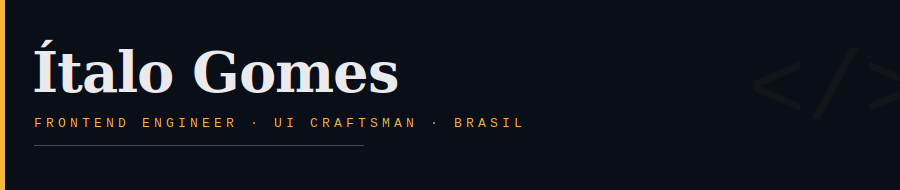

 

[**↗ LinkedIn**](https://linkedin.com/in/italoog) &ensp;|&ensp; [**↗ Email**](mailto:italo.og@outlook.com) &ensp;|&ensp; [**↗ GitHub**](https://github.com/italoog) &ensp;&ensp;&ensp; 

---

## Hello, I'm Ítalo

Frontend Engineer from **Brasil 🇧🇷** passionate about building interfaces people love to use.
I believe great UI is invisible — it just works, beautifully.

My craft lives in **React**, **Next.js**, and **TypeScript**, but I'm equally obsessed with the
CSS that brings everything to life. I care deeply about clean code, performance, and the details
that make the difference between good and great.

---

## Featured Work

<table>
<tr>
<td width="50%" valign="top">

### 🎮 Pokemon Challenge
An interactive Pokemon explorer. Fast, accessible, and fun — built with modern web technologies from top to bottom.

[**View project →**](https://github.com/italoog/pokemon)

</td>
<td width="50%" valign="top">

### 🚀 Go Move
A performance-focused project showcasing smooth animations and transitions. Optimized code, fluid experience.

[**View project →**](https://github.com/italoog/go-move)

</td>
</tr>
</table>

---

## Tools I reach for

**Frontend** &nbsp;&nbsp; React &nbsp;·&nbsp; Next.js &nbsp;·&nbsp; TypeScript &nbsp;·&nbsp; JavaScript  
**Styling** &nbsp;&nbsp;&nbsp;&nbsp;&nbsp; Tailwind CSS &nbsp;·&nbsp; SCSS &nbsp;·&nbsp; CSS  
**Build** &nbsp;&nbsp;&nbsp;&nbsp;&nbsp;&nbsp;&nbsp; Vite &nbsp;·&nbsp; Webpack &nbsp;·&nbsp; Node.js  
**Craft** &nbsp;&nbsp;&nbsp;&nbsp;&nbsp;&nbsp;&nbsp;&nbsp; Figma &nbsp;·&nbsp; Git &nbsp;·&nbsp; VS Code  

---

## Activity

  

---

## 3D Contribution Calendar

  

---

## Snake

  <picture>
    <source media="(prefers-color-scheme: dark)" srcset="https://raw.githubusercontent.com/italoog/italoog/output/github-contribution-grid-snake-dark.svg"/>
    <source media="(prefers-color-scheme: light)" srcset="https://raw.githubusercontent.com/italoog/italoog/output/github-contribution-grid-snake.svg"/>
    
  </picture>

---

## Stats

  
  &ensp;
  

  

---

*Let's build something together.*  
**[italo.og@outlook.com](mailto:italo.og@outlook.com)**
