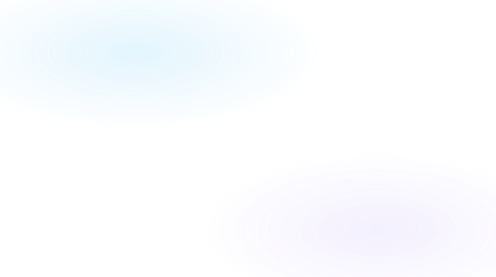

  

 

  Frontend engineer who treats the browser as a craft bench — 
  design systems, UI libraries, and the last 5% of polish most people skip.

  

 

### Selected work

- **[exame-ai-news](https://github.com/italoog/exame-ai-news)** — enterprise-grade news platform with generative AI, inspired by EXAME, Bloomberg & Medium · `TypeScript` `Next.js`
- **[objective-ui](https://github.com/italoog/objective-ui)** — UI component experiments, where the design-system ideas get stress-tested · `TypeScript`
- **[pokemon](https://github.com/italoog/pokemon)** — Pokédex built for a frontend challenge · `TypeScript`

 

  <picture>
    <source media="(prefers-color-scheme: dark)" srcset="https://raw.githubusercontent.com/italoog/italoog/output/github-contribution-grid-snake-dark.svg" />
    
  </picture>

 

  <a href="mailto:italo.og@outlook.com">email</a>
  &nbsp;·&nbsp;
  <a href="https://www.linkedin.com/in/italoog">linkedin</a>

  ✦ the banner above is a hand-written animated SVG — no generators, no templates · <a href="assets/hero.svg">view source</a>

